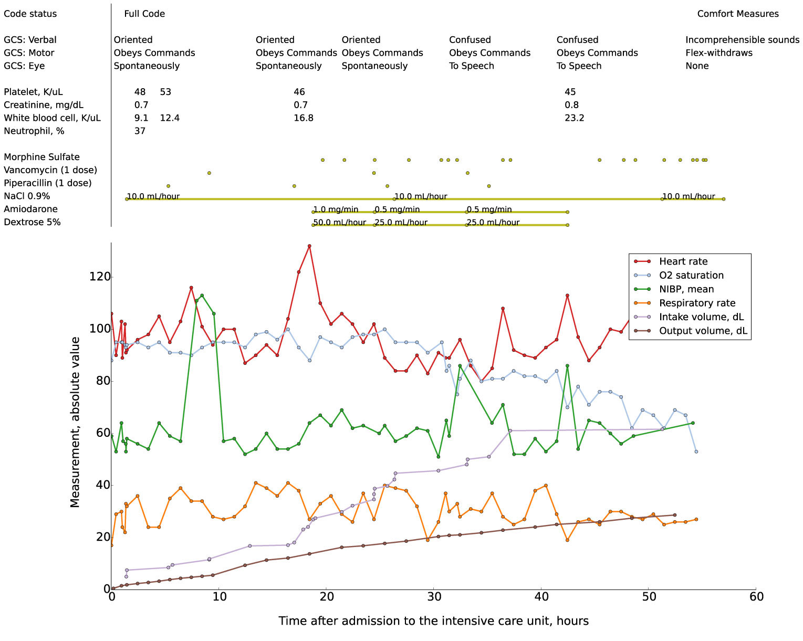

# Data

- [PhysioNet](https://physionet.org/) is a data sharing platform built and maintained at the Laboratory of Computational Physiology at MIT

## MIMIC Database

The [MIMIC Database](https://mimic.mit.edu/) is a publicly accessible critical care database. It is widely used in biomedical signal processing research because it contains a variety of physiological signals collected from many thousands of patients.

The database is a valuable resource for open research in biomedical signal processing because:
- the signals (_a.k.a_ waveforms) are openly available ([here](https://physionet.org/content/mimic4wdb/0.1.0/))
- open software is provided to analyse the waveforms ([here](https://wfdb.readthedocs.io/en/stable/))

---

## Example patient

_Reproduced under [CC BY 4.0](https://creativecommons.org/licenses/by/4.0/) from: Johnson AEW et al. MIMIC-III, a freely accessible critical care database. Sci Data 2016; 3: 160035. https://doi.org/10.1038/sdata.2016.35_
